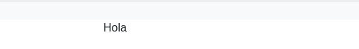
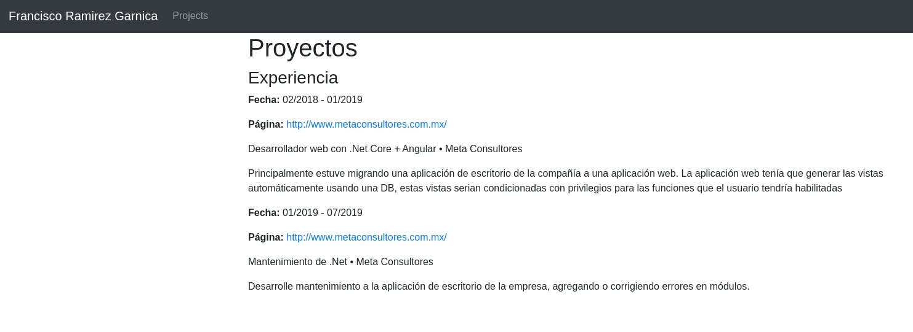

# FranciscoRam.github.io
Pagina donde se presentara mi portafolio personal, asi como una prueba para mi primer proyecto HTML, CSS y JS construido a base de componentes.

La finalidad de los componentes es poder mejorar el mantenimiento de esta pagina, asi como su escabilidad.

Ya he usado componentes en RubyOnRails, Angular y React, esto es un desafio propio para probar mis habilidades para construir una pagina, escalable, automatica y eficaz.

## Commits
### Hello world
Agregando archivos de prueba para la primera vista del portafolio, probando los archivos index.html y index.js

### Read and Insert component
Agregando el uso de un archivo HTML, leyendolo usando XMLHttpResponse y posteriormente insertandolo en index.html.

El uso de esto es para poder crear componentes que representen cada pieza de la pagina, siendo mas fácil su posterior modificación/edición.

### Nav header component
Cree los componentes para generar un header a partir de un objeto, el objeto usado es:
```js
const objNav = {
  id: "nav-header", 
  main: "Francisco Ramirez Garnica", //No necesario
  type: "dark", //No necesario
  class: "test", //No necesario
  list: {
    id: "", //No necesario
    class: "", //No necesario
    type: "navbar", //No necesario
    items: [ //Necesario para agregar la lista
      {
        id: "",//No necesario
        class: "test",//No necesario
        name: "Projects",
        href: "#projects", //Necesario si se quiere que sea un link
        title: ""//No necesario
      }
    ]
  }
};
```
Resultara en: 

Si bien no hay campos que no son necesarios al generarse este sera una nav vacio.
```js
const objNav = {
  id: "nav-header"
}
```
Resultara en: 


Una vez terminada la pagina se explicara cada atributo de los objetos necesarios para generar los componentes.

### Section component and Create Element

* **section_component** que es el componente para generar una sección, se llama desde el **index.js** se genera basado en un array de objetos.
```js
const objSection = [
  {
    id: "projects",
    class: "section-project",
    content: "<h2>Projectos</h2>"
  }
];
innerTag.InnerTag("root", "section_component", objSection);//asi se llama
```

* **imports** contiene dos archivos
  * **components.js** contiene todos los importas de los componentes.
  * **functions.js** contiene los imports de las funciones.

* **create_element.js** en este archivo se agregaron las funciones para poder crear un elemento/tag de HTML, de momento los datos que requiere para construirse es un array de objetos, este se estara modificando para mejorar la construcción de elementos HTML.
```js
const objElement = [
  {
    id: "name-id",
    class: "name-class",//Acepta que sea un array de strings
    content: "contenido del elemento"
  }
];
```
* **data** en este folder se planea agregar toda la información en diferentes idiomas.
  * **es_messages.js** contiene los mensajes de error.

### Experience section

Se agrego el contenido para una sección con el nombre de experiencia.
* **es_messages.js** se modifico la estructura de los mensajes.
* **DB** este folder contendra la información para mostrar en las vistas.
* **pages.js** aqui estaran los imports de las vistas de paginas y no de elementos como en components, se planea que este archivo sea modificable dependiendo del proyecto que se trabaje a diferencia del **component.js**.
* **section_component.js** se modifico para agregar una vista.
* **pages** folder modificable dependiendo del proyecto que tendra las vistas para paginas.
* **education, exprience, project** son vistas.
* **create_element.js** se modifico para adaptarse al nuevo contenido.
* **database** este archivo es para leer la información, de momento solo lee el json de DB.
* **inner_tag.js** se agrego la opción para leer las vistas.
* **messages.js** el archivo que manejara la devolución de mensajes.
* **index.js** ahora el objeto para las secciones tiene un nuevo campo para leer, el campo es **page**.
```js
const objSection = [
  {
    id: "projects",
    class: "section-project",
    content: "<h1>Proyectos</h1>"
  },
  {
    id: "experience",
    class: "section-experience", 
    page: {
      title: "Experiencia",
      name: "experience",
      file: "es_experience.json"
    }
  }
];
```
El Resultado hasta el momento de todos los cambios hasta este punto es:


## Bibliografia
*   **[Javascript Async Await, Promesas y Callbacks - Fazt](https://www.youtube.com/watch?v=Q3HtXuDEy5s)**
*   **[XMLHttpRequest documentation](https://xhr.spec.whatwg.org/)** 
*   **[XMLHttpRequest (AJAX) ¿Cómo funciona? - Leonidas Esteban](https://www.youtube.com/watch?v=4l0PELZZqAM)**
